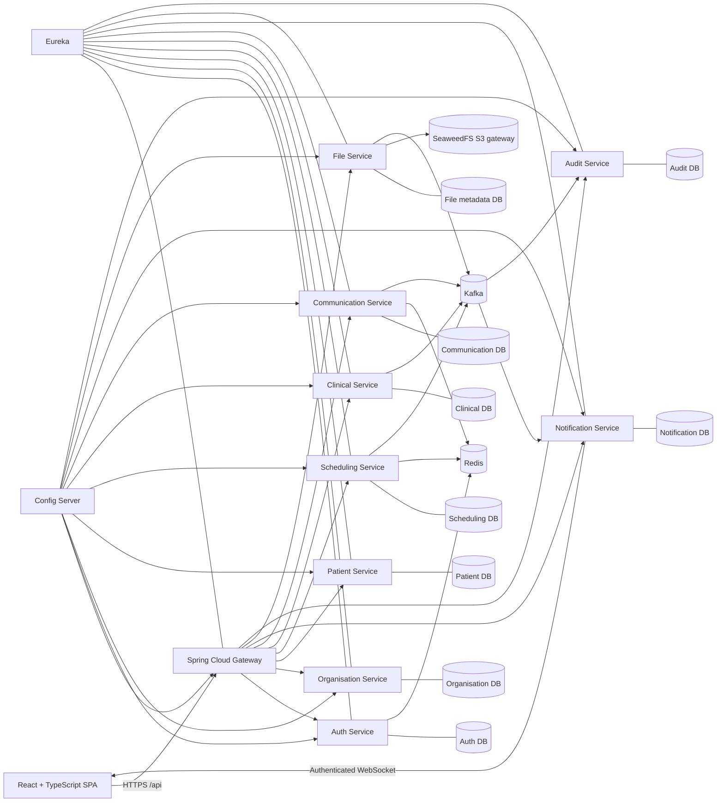

# Sahha internship project context

Last updated: 2026-09-27

## 1. Purpose

Sahha is a secure healthcare management and collaboration platform for:

- Independent doctors and private practices.
- Clinics and hospitals with departments and multiple staff roles.
- Patients using a limited self-service portal.

The distinguishing capability is controlled collaboration around a patient.
Sahha must present a coherent patient journey without granting every
professional access to the complete medical record.

The active goal is the first coherent internship version, not the complete
future platform.

## 2. Source-of-truth order

When requirements appear to conflict, use this order:

1. The user's latest explicit instruction.
2. This project context.
3. `docs/INTERNSHIP_PLAN.md`.
4. Backend API and security contracts.
5. The existing frontend prototype.

The frontend is the approved UX baseline, but its extra screens do not expand
the internship scope.

## 3. Active users and organisation model

### Platform administrator

Manages the Sahha platform. In the current internship slice, this is the only
role that can create a healthcare organisation, and the new organisation is
active immediately. Applicant self-registration, documentary review, external
licence verification, and approve/reject processing are deliberately deferred.
The role also manages organisation suspension, platform configuration,
support, and technical/security monitoring, but has no automatic access to
clinical records.

### Organisation administrator

After an organisation exists and the administrator membership is assigned,
manages that hospital, clinic, or private practice, its departments,
invitations, doctors, receptionists, other staff memberships, and organisation
roles. This authority is limited to organisations where the user has an active
administrator membership and does not imply clinical authority.

### Doctor

Manages a professional profile, availability, appointments, authorised patient
history, consultations, diagnoses, basic prescriptions, documents, messages,
referrals, sharing, and notifications.

### Receptionist

Manages administrative patient registration, search, schedules, appointments,
check-in, and the waiting list. The role cannot read clinical notes, diagnoses,
prescriptions, or unrelated medical documents.

### Patient

The internship portal is limited to authentication, profile, doctor search,
appointment requests/history/status, and notifications. Authorised
prescriptions or documents may be added only after the core workflow is stable.

### Multi-organisation rule

A user has one Sahha identity and separate memberships in each organisation. A
request is always evaluated using an explicit active organisation context. A
doctor may be a hospital doctor in one organisation and an owner/doctor in a
private practice in another.

## 4. Internship end-to-end workflow

The primary acceptance journey is:

1. A Platform Administrator creates an active hospital, clinic, or private
   practice.
2. The designated Organisation Administrator configures the
   organisation and creates its departments.
3. The Organisation Administrator adds or invites a doctor and receptionist
   and assigns their memberships and roles.
4. The doctor completes a professional profile and configures availability.
5. The receptionist registers or finds a patient.
6. Duplicate-patient checks run before registration is confirmed.
7. The receptionist books an available appointment.
8. The doctor receives a real-time notification and confirms or reschedules.
9. The receptionist checks the patient in.
10. The doctor starts the consultation.
11. The doctor records clinical information, diagnosis, medication, and
    follow-up.
12. The doctor securely uploads a medical document.
13. The doctor finalises the consultation; it becomes immutable.
14. The doctor messages another doctor and creates a same-organisation
    second-opinion or shared-treatment referral with recorded consent and scope.
15. For a second opinion, the receiving doctor sees only selected information
    and the first doctor remains responsible for treatment. For an accepted
    treatment referral, both doctors treat the patient; the recipient may read
    the authorised finalised clinical history and documents in that organisation
    and add their own treatment records, without overwriting finalised records.
16. Revocation and expiry remove shared access.
17. The receptionist and unrelated doctors remain unable to access protected
    clinical information.
18. Sensitive reads, writes, denials, sharing changes, and file access are
    auditable.

## 5. Included scope

- Authentication, refresh, logout, account status, and secure browser sessions.
- Active organisation selection, organisation profiles, departments,
  memberships, invitations, and the core roles.
- Doctor professional profiles and organisation-specific availability.
- Administrative patient identity and duplicate detection.
- Appointment creation, confirmation, rescheduling, cancellation, check-in,
  start, completion, and no-show handling.
- Basic consultations, history, symptoms, vital signs, examination, diagnoses,
  treatment, medication, follow-up, finalisation, and corrections.
- Basic prescription information inside the Clinical Service.
- Secure medical-file upload and download through SeaweedFS in development.
- Doctor messaging, referrals, selected-data sharing, consent evidence,
  acceptance, rejection, revocation, and expiry.
- In-app and WebSocket notifications.
- Append-only audit foundation.
- React interfaces for organisation administrators, doctors, receptionists, and
  a limited patient portal.
- Independent service-owned PostgreSQL databases, Flyway migrations, Eureka,
  Gateway, Config Server, Kafka, selected Redis use, native local development,
  automated tests, and a CI/CD foundation for Azure deployment without
  project-managed Docker containers. Azure resource selection remains a
  deployment design decision; no cloud provisioning is authorised by this note.

## 6. Explicitly deferred scope

- Central Audit event ingestion, history screens and query APIs are deferred by
  the user's 2026-09-20 release-scope decision. Existing service-local audit
  recording and security controls remain required.
- Patient SMS/email/push, referral-only encounters, and reusing existing clinical
  documents as message uploads are not part of this delivery. Shared-treatment
  doctors record treatment through their own appointments/consultations; initial
  message attachments are new uploads. Clinical documents retain explicit sharing.
- Complete laboratory and radiology operations.
- Pharmacy, dispensing, drug interaction engines, and electronic signatures.
- Insurance, complete billing, claims, budgets, expenses, and inventory.
- Bed management, admissions, transfers, and advanced hospital operations.
- Nurses and other future professional workspaces.
- Telemedicine, national integrations, advanced analytics, and AI.
- Docker packaging, Docker Compose, and Kubernetes/K3s are outside the current
  V1 delivery requirements (user decision, 2026-09-10).
- Real patient data.
- Public organisation applications, regulatory-document uploads, manual
  approve/reject queues, and external verification of professional or facility
  licences.

## 7. Domain invariants

### Confidentiality and minimum necessary access

- Every protected request is authorised on the backend.
- React route guards improve UX only and are never security controls.
- Responses use role-specific DTOs so prohibited fields are not serialised.
- A protected resource may return `404` rather than reveal its existence.

### Organisation isolation

- Every organisation-owned row carries an organisation identifier.
- Repository queries are scoped by active organisation when applicable.
- Membership and active organisation are validated, not accepted from arbitrary
  client input.

### Clinical separation

- Administrative and clinical DTOs, endpoints, permissions, and tests remain
  separate.
- Receptionists can update administrative data but cannot receive clinical
  fields.

### Appointment integrity

- Appointment transitions follow an explicit state machine.
- Database constraints and optimistic locking prevent double booking and lost
  updates.
- Redis may assist caching or temporary coordination but is not the sole
  protection against double booking.

### Clinical record integrity

- Draft consultations can change.
- Finalised consultations are locked.
- Corrections append the old value, new value, author, timestamp, and reason.
- Clinical history is never silently overwritten.

### Sharing

- A message or patient mention grants no record access.
- An author may explicitly anchor a conversation or selected referral to their
  own finalised consultation after the encounter ends. Clinical verifies their
  original current Doctor membership, organisation and patient. This authorises
  the collaboration command, not continuing care or patient-wide recipient access;
  the source ID is immutable and is not exposed in recipient DTOs/events.
- V1 referrals stay within the active organisation. Second-opinion referrals
  grant selected-information access only. Treatment referrals establish shared
  care after acceptance and recorded consent/authorisation; the first doctor
  keeps treating the patient and the second joins, rather than replacing them.
- Shared-treatment access is explicit, audited, revocable and time-bounded.
  It covers authorised finalised clinical history and documents in that
  organisation, not unrelated organisations or another doctor's drafts.
  Each doctor's participation is tracked separately; referral acceptance does
  not authorise overwriting any finalised record. Communication care authority
  and the Clinical/File history/document consumers and creation UI are implemented.
  The native synchronous access and referral notification gates pass. The
  combined browser/history/file and new-treatment acceptance journey remains open.
- A grant identifies the recipient, patient, selected resource scopes, purpose,
  consent evidence, start, expiry, and status.
- Clinical and File services verify an active grant before returning shared
  data.
- Revocation and expiry take effect without relying on a stale long-lived token.

### Files

- Object bytes live in SeaweedFS or secure object storage.
- PostgreSQL stores metadata, checksum, ownership, category, and storage key.
- Upload and download are authorised.
- URLs are short-lived; permanent public URLs are prohibited.
- Type, size, checksum, and malware-scanning status are validated.

### Audit

- Record actor, active organisation, action, resource, time, result, request ID,
  and access reason where needed.
- Audit records are append-only and idempotent.
- Clinical payloads, secrets, and tokens are not copied into audit events or
  logs.

## 8. Planned system shape

For local development, separate logical databases may share one PostgreSQL
server, but they use separate credentials and no cross-service table access.

## 9. Service ownership

| Component | Owns |
| --- | --- |
| Auth Service | Accounts, credentials, access/refresh token lifecycle, session security, account status |
| Organisation Service | Organisations, departments, memberships, invitations, roles, doctor affiliations |
| Patient Service | Administrative patient identity, contacts, identifiers, organisation registration, duplicate candidates |
| Scheduling Service | Availability, breaks, absences, slots, appointments, state transitions, check-in |
| Clinical Service | Consultations, history, symptoms, vitals, diagnoses, basic prescriptions, finalisation, corrections |
| Communication Service | Conversations, messages, typed referrals, referral-bound care participation, consent references, share requests, grants, revocation, expiry |
| Notification Service | Notification projections, unread state, WebSocket delivery, preferences |
| File Service | File metadata, secure upload/download negotiation, attachment links, storage access checks |
| Audit Service | Append-only security and business audit events and authorised audit queries |
| API Gateway | Public routing, request IDs, session/token edge handling, coarse route policy, rate limits |
| Config Server | Externalised service configuration; not a domain service |
| Eureka | Service discovery; not a source of business data |

No service may directly modify another service's database.

## 10. Communication and consistency

- REST is used for immediate commands, queries, and security decisions.
- Kafka is used for meaningful domain events such as appointment changes,
  consultation finalisation, referral/share changes, and file availability.
- Domain services use a transactional outbox so database changes and events do
  not diverge.
- Consumers are idempotent and tolerate duplicate delivery.
- The browser never publishes to Kafka.
- WebSocket notifications are a projection; REST remains the recovery/source
  path after reconnect.
- A request ID, actor ID, active organisation ID, event ID, occurred-at time,
  resource version, and minimal necessary payload accompany relevant operations.

## 11. API and security conventions

- Public APIs are exposed under `/api/v1` through the gateway.
- Errors use `application/problem+json` with a request ID and safe field errors.
- `401` means no valid session, `403` means a known but forbidden operation,
  `404` may conceal a protected resource, `409` handles state/version/slot
  conflicts, and `422` handles semantic validation.
- Mutable aggregates use an explicit version for optimistic locking.
- Retryable creation/payment-like commands use idempotency keys where relevant.
- Timestamps are UTC ISO-8601; display localisation belongs to the frontend.
- Backend identifiers should be opaque strings/UUIDs. The frontend's current
  numeric doctor IDs must be normalised during integration.
- OpenAPI documents the external contract; generated contracts may be adopted
  after the first stable vertical slice.
- The browser uses `Secure`, `HttpOnly`, `SameSite` cookies for short-lived
  access and rotating refresh tokens. CSRF protection is required for
  cookie-authenticated state changes.
- Gateway validation does not replace resource-server validation inside each
  service.
- Auth persists one `UserSession` per login/device and uses its ID as the
  refresh-token family identifier.
- Redis may cache only a minimal, versioned Auth session projection with an
  expiry bounded by the session lifetime. PostgreSQL remains authoritative,
  refresh rotation always verifies PostgreSQL, and Redis loss must not lose
  revocation state.

## 12. Approved technology direction

### Frontend

React, TypeScript, Vite, React Router, TanStack Query, React Hook Form, Zod,
Fetch or Axios, WebSocket/STOMP, Vitest, React Testing Library, and Playwright.

### Backend

Java 21, Spring Boot, Spring Web, Spring Data JPA, Spring Security, Spring
Validation, Spring Kafka, Spring WebSocket, Spring Cloud Gateway, Eureka,
Spring Cloud Config, OpenAPI, Maven, JUnit, Mockito, and isolated native
infrastructure integration tests. Docker/Testcontainers are not required.

### Data and infrastructure

PostgreSQL, selective JSONB, Redis for bounded technical use cases, SeaweedFS,
Kafka, Git/GitHub, GitHub Actions, and Azure without requiring Docker. Keep the
native local workflow. Hosting, private networking, identity/secrets, storage,
Kafka and Redis deployment choices must be verified before Azure rollout;
substituting a managed provider must not silently change service contracts.

The Maven parent declares Spring Boot `4.1.0` and Spring Cloud `2025.1.2`.
Java 21 compilation, dependency resolution, all 12 application context tests,
executable-JAR packaging, and application startup smoke checks passed together
on 2026-07-25.

## 13. Existing workspace baseline

Current snapshot (2026-09-26): Phase 6 is active. The approved release order is
referrals, patient in-app/WebSocket notifications, new-upload message attachments,
then full application acceptance and critical/security fixes before cloud planning.
Central Audit ingestion/history/queries are deferred; local audit controls remain.
Fresh-checkout/empty-data verification remains a final gate, not a feature prerequisite.

Communication now models immutable SECOND_OPINION/SHARED_TREATMENT referrals.
Old data/omitted types stay SECOND_OPINION. Accepted shared treatment records both
doctors' grant-bound care participation and exposes a separate, live, audited
same-organisation/patient decision with membership, expiry and termination checks.
Clinical now consumes that authority on every protected history/list and finalised
record read, independently checking its own organisation/patient/finality. The
referral drawer has an explicit read-only shared-care history preview with expiry,
denial, lifecycle/context and late-response cleanup. Its encounter document viewer
now uses protected File discovery/metadata and one-time downloads, with fresh
Clinical-owned finality/patient and live Communication care checks before issuing
tokens and returning bytes. Upload and author-write permissions are unchanged.
File V4 binds tokens to OWN/SELECTED/SHARED_CARE routes; old short-lived LEGACY tokens
must be reissued. The owner-boundary slice passed 214 backend tests (one optional
native-storage test skipped), production/service builds and two intercepted
desktop/mobile document scenarios.
The existing composer now explicitly creates either second opinions or shared
treatment, with distinct scope acknowledgement, renewed consent after type
changes and frozen retry commands. All 319 frontend tests/build and eight
desktop/mobile creation contract cases passed. The native synchronous access
gate passed 112 Gateway assertions across Communication, Clinical and File,
including both doctors' history/PDF access, role/org/patient isolation, immutable
author boundaries, revocation of an outstanding token, independent grants,
completion and expiry. All 41 retained-generation migrations and 101 isolation
checks passed; the tools suite passed 142 tests (one optional infrastructure skip).
All owned runtimes stopped, with zero project listeners; shared PostgreSQL remains.
Referral lifecycle notifications are now complete: a strict routing-only consumer,
Notification V4 transactionally deduplicated/versioned projection, private inbox
and after-commit WebSocket delivery, with existing recipient/organisation/session
checks. The React inbox supports six update types, duplicate handling and referral
REST refresh on events/reconnect; opening an alert grants no record access.
Verification on 2026-09-24 passed 147 backend tests/JAR packaging, all 339 frontend
tests/build, 147 tooling tests (one optional infrastructure skip), all 42 retained
migrations and 101 isolation checks. Real React/Gateway/Kafka acceptance passed
103 assertions across six types: nine observed WebSocket alerts and one interrupted-
run REST recovery, with private routing, read/reload recovery and viewport checks.
A Windows Kafka retention file-lock failure was worked around with a separate
synthetic-only retained config; no application/broker data reset was performed.
All owned apps/helpers stopped, zero project listeners; shared PostgreSQL retained.
Patient in-app/WebSocket appointment notifications are now verified. Separate
patient/org inboxes use Patient's fresh own-active-registration authority, with
session/ownership checks for live frames and no inferred staff membership.
Verification passes 241 affected backend tests/JAR packages, 350 frontend tests/
production build, 151 tooling tests (one optional skip), 43 retained migrations
and 101 isolation checks. The real React/Gateway/Kafka gate passes 49 assertions:
five retained live deliveries and one offline REST recovery, private access,
read/reload/mark-all behavior and desktop/mobile checks. A real soft-shell dropdown
click-interception bug was fixed with four passing Chromium layout regressions.
All owned services/helpers stopped; zero project listeners, shared PostgreSQL retained.
New-upload message attachments are now verified for synthetic internship V1:
File and Communication own separate V5 metadata, immutable message references,
fresh original-doctor participation checks, quarantine and private one-use bytes.
The existing messenger supports up to five new PDF/PNG/JPEG uploads per text
message, scan status, exact retries and protected downloads. Clinical documents
still require explicit sharing; messaging grants no patient-record access.
On 2026-09-26, 239 affected backend tests/packages pass (one optional legacy storage
skip), 26 focused frontend tests/build and four runner contracts pass, and the
real browser/Gateway/private-storage gate passes 29 assertions. The retained
generation has 45 applied migrations and zero pending. All owned services/helpers
are stopped. The user resumed full-application testing on 2026-09-27; its
acceptance gate is now active, with no cloud provisioning authorised.
The local scan hook is synthetic only; a production scanner and abandoned-upload
retention must be addressed before production use.
Scheduling's original-booking retry after rescheduling was reproduced and repaired
on 2026-09-27: comparison now uses the immutable BOOKED audit snapshot rather than
mutable appointment time. All 85 Scheduling tests/package pass, including staff/
patient retries and a real HTTP reschedule regression. Live acceptance is pending.
Each doctor's own new
treatment appointment/consultation and the combined browser/referral/history/file
journey still require final acceptance. No production malware-scanning claim.
This is not completion of the full shared-treatment feature or Phase 6.

Auth, Organisation, Patient,
Scheduling, Clinical, Communication, Notification and File have real API/data
slices; Audit now has its owned PostgreSQL/Flyway foundation but no central
ingestion or query API. Its business HTTP surface is closed. Active frontend
workspaces use Gateway-backed
adapters with explicit mock opt-in. Branding, deferred-route isolation and the
Phase 3/4/5 core workflows have recorded verification. Referral creation,
participant lifecycle and read-only exact selected-content/file previews use
real API adapters. The UI checks recipient/grant context, discards stale payloads
on denial/expiry/context changes and requests protected reads/downloads only.
Protected new-upload message attachments are verified as described above. The full
referral/shared-care browser and new-treatment exit journey remains incomplete. Messaging's
real two-doctor browser/Gateway/Kafka delivery and restart recovery are verified
on 2026-09-19 (48/45 assertions); they do not complete the entire Phase 6 journey.
Older-phase native tooling/configuration and Clinical membership-access repairs
have recorded verification. Session/account invalidation is enforced by fresh
Auth-owned decisions at Gateway and implemented resource services, including
WebSocket frames; the technical `session-security` library owns no domain data.
Frontend workspace access now uses every explicitly assigned role in the active
organisation, plus global platform roles. The default landing role does not limit
access to other assigned workspaces. The navigation selector changes neither
organisation nor server authority, and administrators gain no clinical access
without the Doctor role. Doctor appointment views select their own rows without
narrowing administrative caches. Backend operation permissions are now separately
defined in service-owned catalogues and derived from explicit roles in the proper
global/organisation scope; HTTP and WebSocket gates enforce them without replacing
live membership, ownership or sharing decisions. See `docs/BACKEND_PERMISSIONS.md`.
Audit V1 stores bounded metadata with source-event uniqueness and database-level
append-only enforcement. Isolated-schema, HTTP-denial and native startup checks
pass; see `docs/AUDIT_PERSISTENCE.md`. Consistent health/readiness policies and
154 policy integration tests are now implemented across all twelve applications.
The full backend build passes (888 passed, one optional storage test skipped),
including 177 new API protocol/OpenAPI/correlation tests and a new Auth
two-organisation Doctor/Receptionist context-switch regression. All twelve
applications package successfully. Safe framework/edge errors, explicit
conjunctive API credentials and baseline redacted logging are verified;
Phase 7 structured observability/privacy acceptance remains open. See
`docs/API_CONVENTIONS.md`. Frontend verification passes 216 tests, the production
build and 32 synthetic browser contract/layout checks, not live Kafka acceptance.
Native probe checks now pass for all twelve applications (108 assertions), after
the renewed pre-cloud completion request. Gateway/Audit were checked individually
and stopped with their helpers. All project services/helpers are stopped; only
shared PostgreSQL remains running. An isolated Windows-native database bootstrap
now creates nine restricted databases on loopback 15432 and applies/revalidates
their service-owned Flyway scripts. Its reset creates a fresh generation while
retaining the old data; 34 tooling tests, 101-check access matrices and a 45-assertion
native migration/reset/recovery gate pass. See `docs/SYNTHETIC_BOOTSTRAP.md`.
Synthetic accounts/staff and a temporary isolated identity launcher are now
verified through real Gateway/Auth/Organisation APIs: eight synthetic identities,
two organisations, explicit staff invitation acceptance, doctor profiles and
role/tenant denials. Repeat setup preserves credentials/aggregates; unsafe seed
targets are refused. The native gate passes in 288 seconds; 201 Auth/session
regressions and 49 tooling tests pass. Phase 2 V1 is complete. A private temporary
Redis bootstrap passes authentication, TTL and scoped cleanup verification.
The 2026-09-16 native Redis/Kafka/SeaweedFS bootstrap/restart/refusal gate passes
in 148 seconds, with exact loopback listener ownership, authenticated protocol
checks, retained cluster/object identity and failure cleanup; 53 tooling tests
pass. All four isolated application batches now pass 243 operational assertions
across 27 service starts, covering all twelve applications with Config consumption
and live Gateway role checks. Kafka-enabled startup exposed missing Boot Kafka
starters in Auth/Organisation/Patient; corrected dependencies pass full affected-
module regression (346 tests, zero failures/errors/skips). The first/repeat Gateway
patient workflow passes 40/32 assertions, retaining one registration, an explicit
patient-account link, two doctor availability schedules and one appointment.
Clinical recovery and fresh-process repeat pass 31 assertions each, including
the completed appointment projection, immutable signed record and one attributable
correction. Primary-file recovery/repeat passes 22/20 Gateway/storage checks;
a fresh second-file upload/repeat passes 24/20 and the original-file preservation
repeat passes another 20. Synthetic scan decisions
are not malware-scanner validation. Messaging recovery/repeat passes 51 checks
each through real Gateway/Kafka, retaining the same conversation/message/private
notification. This exposed and fixed Notification's canonical cookie-setting
mismatch; Notification/shared-session verification passes 114 tests and packages
the service. All 101 tooling tests and 13 focused frontend messaging/notification
tests pass. A 2026-09-18/19 follow-up fixes finalised-source handoff through the
existing referral composer and an optional metadata-only conversation selector.
The source-bound repair passes 186 backend tests; all 225 frontend tests and the
production build pass, followed by nine passing selector-label regressions.
Native selected-sharing acceptance passes 81 real Gateway assertions in serial
Clinical/Communication and File/Communication batches (28/29/24): mentions give
no access, accepted grants expose only selected data, unselected content stays
denied, expiry and revocation work, an outstanding file token is rejected after
revocation, and signed originals remain unchanged. The third batch rechecks the
same revoked grant after restarting. Tooling passes 108 tests and 38 migrations
revalidate with 101 isolation assertions. All 34 desktop/mobile browser-contract
scenarios pass, including the source picker; their HTTP is intercepted. The later
2026-09-19 real browser messaging gate passes 48 live and 45 fresh-process recovery
assertions, with actual message/Kafka-notification frames, socket-only and page
recovery, private-recipient/context denials and desktop/mobile viewport checks.
It preserves one message/notification and uses no mocked HTTP or WebSocket frames.
It exposed and fixed Communication's hard-coded origin, REST route shadowing and
misnamed raw-CSRF interceptor, plus the frontend's empty reconnect callback.
All 113 affected backend, 226 frontend and 119 tooling tests pass; executable JAR
and frontend production builds pass. Project listeners and owned synthetic runtimes
are stopped; shared PostgreSQL remains. A separate 2026-09-20 ordered native
retained-data run now passes all 16 stages in 43 minutes, including 45/45 real-browser
replays, 58 preserved identifiers, stable source/artifact fingerprints and complete
helper cleanup. The first run exposed Windows parent-PID reuse during shutdown;
creation-time-aware ownership fixes it without touching the unrelated older process.
All 136 default tooling tests and the separate native failure-cleanup test pass.
The operation lock is released and no project listeners/owned runtimes remain.
Full referral/shared-care browser acceptance, fresh-checkout/empty-generation and
clean-machine acceptance remain open.
None of these results implies Azure readiness.
Temporary helpers stop after each batch.
The unfinished Phase 6/7/8 pre-cloud gates remain open. Azure is not provisioned
and cloud readiness is not yet claimed. See `docs/HEALTH_READINESS.md`.
Central Audit ingestion/query is deferred by the release-scope decision;
service-local controls remain required. Other carry-overs remain open.
See the living plan, `docs/SESSION_SECURITY.md` and `docs/NATIVE_DEVELOPMENT.md`.

The detailed baseline below is a historical migration/early-integration snapshot,
not the current completion report. References to unfinished Patient integration,
Aegis branding, mocked active workspaces or absent domain services are superseded
by the current snapshot and dated tracker evidence.

### Sahha workspace

Current modules use flat, independently deployable directories:

- `discovery-server`
- `config-server`
- `api-gateway`
- `auth-service`
- `organisation-service`
- `patient-service`
- `scheduling-service`
- `clinical-service`
- `communication-service`
- `notification-service`
- `file-service`
- `audit-service`

The Sahha root is now a Git repository on `main` with a Maven parent/aggregator,
root Maven Wrapper, repository controls, and shared IntelliJ run
configurations. The discovery module is enabled as a Eureka server on port
`8761`, and Config Server uses a local native repository on port `8888`.
Gateway listens on local port `8079` and routes Auth, Organisation, and its
public JWKS through Eureka,
validates Auth's RS256
access cookie, forwards browser cookies without retaining shared client state,
and establishes the request-ID, CORS, error, header-sanitisation, and baseline
security-header policies. Auth and Organisation own verified Flyway-backed
persistence slices. Patient now has its first administrative-registry
migration, API, security, audit, outbox, Gateway route, and frontend
integration in the worktree. Its PostgreSQL migrations and backend contracts
are verified by 10 passing Patient tests plus 23 passing Gateway tests; the
remaining Phase 3 step is a live multi-service browser workflow. The remaining
domain services still have no business APIs or migrations.

All current services have tracked, service-appropriate source and test package
trees. Domain services use explicit controller, DTO, entity, repository,
service, mapper, exception, security, client, event, and outbox boundaries.
Gateway, Discovery, and Config use smaller edge/infrastructure-specific
structures. The rules are documented in
`docs/BACKEND_PACKAGE_STRUCTURE.md`.

Auth uses its owned `sahha_auth` database, Flyway version 7, Hibernate schema
validation, and a guarded isolated `sahha_auth_test` integration database. Its
persistence model currently contains the global user account, account status,
credential/lock state, verified contact timestamps, normalized-email identity,
the seeded global `PLATFORM_ADMIN` role, and auditable user-platform-role
assignments. It also contains per-device `UserSession` token families and
hash-only refresh-token rotation lineage with database-enforced
same-user/same-family ownership and one active token per family. Purpose-scoped
verification/reset tokens are single-use and hash-only, and the implemented
service foundation covers configurable BCrypt credentials, registration,
email verification, password reset, account-state enforcement, failed-login
counting, and timed locking. Its public `/api/v1/auth` contracts now cover
registration, email verification/resend, and password-reset request/confirm
with validated DTOs, request IDs, safe Problem Details, generic accepted
responses, request cooldowns, and IP-aware throttling backed by Redis with a
bounded local fallback. Account, verification-token, email, rate-limit,
session, and outbox services are grouped by responsibility. Springdoc
OpenAPI/Swagger now documents all sixteen implemented account and
browser-session operations with synthetic examples, explicit CSRF/cookie
requirements, safe response contracts, and a production disable switch. A
provider-independent Spring Mail adapter targets Brevo SMTP and keeps raw
bearer tokens in memory only while queuing the authentication email. The
ignored local configuration contains the supplied Brevo SMTP settings, and a
live registration verification email completed successfully from the Auth API
through Brevo to the user's inbox.
Auth's PostgreSQL-authoritative session core creates one device-scoped
`UserSession` and hash-only refresh-token family per login, rotates under
pessimistic locking, compromises only the replayed family, and supports safe
active-session listing, owned-device revocation, current/global logout,
authenticated password change, and password-reset session revocation. Its
disposable Redis layer stores only versioned minimal session projections and
hashed-address throttle counters; bounded active TTLs, after-commit
version-aware writes, revocation tombstones, and transparent PostgreSQL
fallback preserve the database as authority.
Auth issues short-lived RS256 access JWTs and rotating opaque refresh
credentials only in scoped HttpOnly cookies, publishes a public-only JWKS,
applies SPA CSRF cookie/header protection, and rechecks sessions and credential
versions. A protected non-rotating current-session read restores browser state
on reload; refresh occurs only near access expiry or after access rejection and
is serialised across tabs with a browser-wide lock. Expired refresh-token
lineage is purged in bounded batches only after absolute session expiry plus
retention, while audit-linked session rows remain. Persisted `PLATFORM_ADMIN`
authority protects account suspension,
reactivation, and disablement, with self-target denial and target-session
revocation. Security-sensitive success and denial activity is append-only in
PostgreSQL and creates a secret-free Kafka outbox row in the same transaction;
publication is acknowledgement-aware and retryable when enabled. Gateway
performs a second coarse cryptographic/claim validation, strips spoofed client
context, and supplies Auth with a trusted edge client address. This does not
replace Auth's session-bound decision or future resource-service validation.
An authenticated user can now select an organisation only after Organisation
Service resolves an active membership and active scoped roles from the JWT
subject. Auth stores that validated context on the locked `UserSession`,
updates its versioned Redis projection after commit, records the selection,
and issues a replacement access cookie containing paired `org_id` and
`org_roles` claims. It does not rotate the refresh token. Auth rejects the
previous access token after a context change because its claims no longer
match the authoritative session projection. Gateway and Organisation Service
also reject malformed scoped claims, while resource-level membership checks
remain inside Organisation Service.
The CSRF bootstrap response exposes the same raw value stored in the readable
XSRF cookie, so Swagger and the frontend can copy the response token directly
into the configured header.
Organisation-scoped roles remain owned by Organisation Service. Patient
Service now models a global stable identity separately from each
organisation-owned registration and contact projection. Submitted national ID
or passport values are normalised into a keyed HMAC fingerprint and last-four
mask; raw values are never persisted or returned. Administrative access
requires a receptionist or Organisation Administrator claim and a live
Organisation Service membership decision. Duplicate checks combine exact
strong-identifier matching with weighted name/date-of-birth, phone, and email
candidates; creation requires an explicit decision when candidates exist.
Administrative writes use optimistic versions, append-only local audit rows,
and a minimal transactional outbox. This implementation remains unverified
until its pending Maven/PostgreSQL suite passes.

Organisation Service now owns a Flyway-backed organisation profile with type,
active/suspended status, contact and address data, audit metadata, and
optimistic locking. Only a JWT carrying the global `PLATFORM_ADMIN` role can
create, list, or read organisations through
`/api/v1/platform/organisations`; creation makes the organisation active
immediately. Each creation transaction also writes an append-only local audit
row and a minimal, secret-free Kafka outbox row. Organisation validates the
Auth issuer, audience, access-token claims, role, and cookie/CSRF pair itself
even when Gateway has already performed its coarse edge check. Its integration
tests use the isolated `organisation_test` schema inside the service-owned
database.
Organisation Service also owns organisation memberships and their independently
assignable roles. A global Platform Administrator can assign the first
`ORGANIZATION_ADMIN` by exact account email. Organisation Service resolves the
identity through an Eureka-aware Auth Service client using only the current
short-lived access credential; it never queries or changes Auth's database.
Only active, email-verified accounts are eligible. The local membership stores
the immutable Auth user ID plus display-only email/name snapshots, while the
role remains scoped to that organisation. Assignment atomically persists the
membership, active role, target-aware append-only audit record, and a
secret-free outbox event. Duplicate organisation/user membership is prevented
by both domain logic and a database unique constraint.
Authenticated users can list their eligible contexts at
`GET /api/v1/organisations/memberships` and resolve one at
`GET /api/v1/organisations/{organisationId}/membership-context`. Suspended
memberships, suspended organisations, memberships with no active role, and
contexts belonging to another user are not returned.
The Platform Administrator React directory now loads, reads, searches, and
creates those organisations through API Gateway using typed contracts,
TanStack Query cache invalidation, validated React Hook Form/Zod input, and
safe 401/403/409 feedback. The selected organisation also lists and reads its
administrator memberships and can assign an eligible existing Sahha user by
email, with safe identity-directory and eligibility failures. Its Gateway URL
remains environment-configurable so local port changes do not leak into
feature code.

The local PostgreSQL `18.1` server on port `5432` now contains a separate
database and restricted login owner for every stateful service. Public database
access is revoked, own-service connectivity passes, and cross-service
connectivity is denied. Generated development connection settings live only in
the gitignored `.env.database.local`. Services are not connected to these
databases until their Flyway-backed vertical slice begins; Auth, Organisation,
and the in-progress Patient slice are connected.

### Existing frontend

Implementation location: `frontend`

Original read-only reference: `C:\Users\LENOVO\Desktop\codex`

Useful assets already present:

- A polished React/Vite interface with responsive role-aware portals.
- Patient, doctor, receptionist, hospital, staff, and platform screens.
- Mock state connecting several workflows across roles.
- Typed models, a service container, mock services, partial REST adapters,
  auth/session context, route guards, tests, and a production build.
- Real Gateway-backed patient registration, email verification, login,
  cookie-session refresh/renewal, and logout, independently selectable from
  the still-mocked domain services.
- A real Gateway-backed Platform Administrator organisation directory,
  creation form, and Organisation Administrator assignment panel using the
  Organisation Service contracts.
- A dedicated role-safe administrative patient model and Gateway REST adapter,
  with TanStack Query receptionist directory/detail screens and a duplicate-
  review registration form. Its component/service tests and production build
  pass; live backend verification remains pending.
- A real active-organisation selector that maps canonical organisation roles
  to the existing role workspaces and synchronises changed context across
  browser tabs.
- An integration document covering cookies, REST errors, gateway usage, and
  backend enforcement.

Integration gaps and scope mismatches:

- It is branded `Aegis`; it must become Sahha.
- It contains many deferred workflows, including finance, beds, pharmacy,
  laboratory operations, staff queues, reviews, and advanced hospital
  operations.
- `src/App.tsx` is large and should be split incrementally by active feature.
- Several rich workflows still use browser-persistent mock state.
- The REST service container covers only part of the visible UI.
- The current dependency set includes React Hook Form and Zod for validated
  forms and TanStack Query for Organisation Service state. A STOMP client
  remains pending.
- Legacy mock doctor/patient workspaces still use a combined presentation
  `Patient` object, but receptionist APIs and screens now use a separate
  administrative-only model. Later Clinical integration must replace the
  legacy object with an explicit clinical projection rather than reusing the
  administrative contract.
- Deferred frontend roles still need canonical V1 mappings as their backend
  slices are implemented.
- Current IDs and several DTOs are presentation-oriented and need stable API
  contracts.

## 14. Frontend integration rule

The source was copied byte-for-byte into `frontend` on 2026-07-25 without
`node_modules`, `dist`, log files, generated TypeScript build state, or
repository metadata. The migrated mock-mode build, tests, and browser
validation passed. Preserve the existing visual design and interactions, then:

1. Rebrand Aegis to Sahha.
2. Hide or feature-flag deferred route families.
3. Establish canonical V1 roles and permissions.
4. Split administrative and clinical patient DTOs.
5. Keep mock mode as a development fallback.
6. Replace one mock workflow at a time with TanStack Query-backed gateway calls.
7. Use React Hook Form and Zod for active forms as they are integrated.
8. Add authenticated notification delivery and reconnect recovery.
9. Verify responsive and accessible behavior at each vertical slice.

## 15. Success definition

The internship succeeds when the complete authorised journey works through the
React application, denial cases are proven, service data remains isolated,
events and notifications are reliable, important operations are audited, and
automated tests protect the core business and security rules.

Feature count is secondary to a reliable, secure end-to-end workflow.
