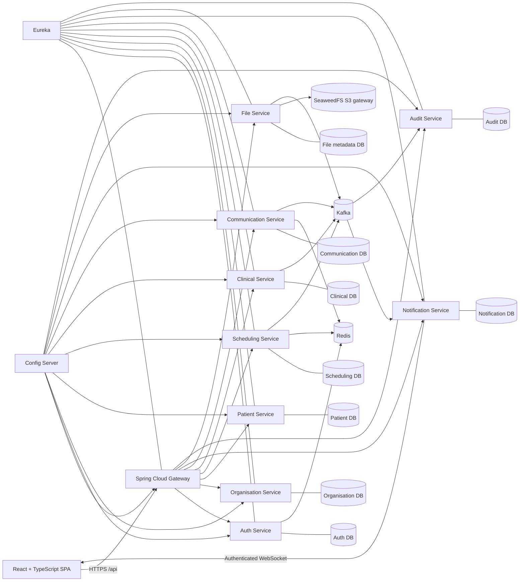

# Sahha internship project context

Last updated: 2026-08-05

## 1. Purpose

Sahha is a secure healthcare management and collaboration platform for:

- Independent doctors and private practices.
- Clinics and hospitals with departments and multiple staff roles.
- Patients using a limited self-service portal.

The distinguishing capability is controlled collaboration around a patient.
Sahha must present a coherent patient journey without granting every
professional access to the complete medical record.

The active goal is the first coherent internship version, not the complete
future platform.

## 2. Source-of-truth order

When requirements appear to conflict, use this order:

1. The user's latest explicit instruction.
2. This project context.
3. `docs/INTERNSHIP_PLAN.md`.
4. Backend API and security contracts.
5. The existing frontend prototype.

The frontend is the approved UX baseline, but its extra screens do not expand
the internship scope.

## 3. Active users and organisation model

### Platform administrator

Manages the Sahha platform. In the current internship slice, this is the only
role that can create a healthcare organisation, and the new organisation is
active immediately. Applicant self-registration, documentary review, external
licence verification, and approve/reject processing are deliberately deferred.
The role also manages organisation suspension, platform configuration,
support, and technical/security monitoring, but has no automatic access to
clinical records.

### Organisation administrator

After an organisation exists and the administrator membership is assigned,
manages that hospital, clinic, or private practice, its departments,
invitations, doctors, receptionists, other staff memberships, and organisation
roles. This authority is limited to organisations where the user has an active
administrator membership and does not imply clinical authority.

### Doctor

Manages a professional profile, availability, appointments, authorised patient
history, consultations, diagnoses, basic prescriptions, documents, messages,
referrals, sharing, and notifications.

### Receptionist

Manages administrative patient registration, search, schedules, appointments,
check-in, and the waiting list. The role cannot read clinical notes, diagnoses,
prescriptions, or unrelated medical documents.

### Patient

The internship portal is limited to authentication, profile, doctor search,
appointment requests/history/status, and notifications. Authorised
prescriptions or documents may be added only after the core workflow is stable.

### Multi-organisation rule

A user has one Sahha identity and separate memberships in each organisation. A
request is always evaluated using an explicit active organisation context. A
doctor may be a hospital doctor in one organisation and an owner/doctor in a
private practice in another.

## 4. Internship end-to-end workflow

The primary acceptance journey is:

1. A Platform Administrator creates an active hospital, clinic, or private
   practice.
2. The designated Organisation Administrator configures the
   organisation and creates its departments.
3. The Organisation Administrator adds or invites a doctor and receptionist
   and assigns their memberships and roles.
4. The doctor completes a professional profile and configures availability.
5. The receptionist registers or finds a patient.
6. Duplicate-patient checks run before registration is confirmed.
7. The receptionist books an available appointment.
8. The doctor receives a real-time notification and confirms or reschedules.
9. The receptionist checks the patient in.
10. The doctor starts the consultation.
11. The doctor records clinical information, diagnosis, medication, and
    follow-up.
12. The doctor securely uploads a medical document.
13. The doctor finalises the consultation; it becomes immutable.
14. The doctor messages another doctor and creates a referral or sharing
    request with selected information.
15. The receiving doctor accepts and sees only the selected information.
16. Revocation and expiry remove shared access.
17. The receptionist and unrelated doctors remain unable to access protected
    clinical information.
18. Sensitive reads, writes, denials, sharing changes, and file access are
    auditable.

## 5. Included scope

- Authentication, refresh, logout, account status, and secure browser sessions.
- Active organisation selection, organisation profiles, departments,
  memberships, invitations, and the core roles.
- Doctor professional profiles and organisation-specific availability.
- Administrative patient identity and duplicate detection.
- Appointment creation, confirmation, rescheduling, cancellation, check-in,
  start, completion, and no-show handling.
- Basic consultations, history, symptoms, vital signs, examination, diagnoses,
  treatment, medication, follow-up, finalisation, and corrections.
- Basic prescription information inside the Clinical Service.
- Secure medical-file upload and download through SeaweedFS in development.
- Doctor messaging, referrals, selected-data sharing, consent evidence,
  acceptance, rejection, revocation, and expiry.
- In-app and WebSocket notifications.
- Append-only audit foundation.
- React interfaces for organisation administrators, doctors, receptionists, and
  a limited patient portal.
- Independent service-owned PostgreSQL databases, Flyway migrations, Eureka,
  Gateway, Config Server, Kafka, selected Redis use, Docker Compose, automated
  tests, and a CI/CD foundation.

## 6. Explicitly deferred scope

- Complete laboratory and radiology operations.
- Pharmacy, dispensing, drug interaction engines, and electronic signatures.
- Insurance, complete billing, claims, budgets, expenses, and inventory.
- Bed management, admissions, transfers, and advanced hospital operations.
- Nurses and other future professional workspaces.
- Telemedicine, national integrations, advanced analytics, and AI.
- Kubernetes/K3s production implementation until the Dockerised V1 is stable.
- Real patient data.
- Public organisation applications, regulatory-document uploads, manual
  approve/reject queues, and external verification of professional or facility
  licences.

## 7. Domain invariants

### Confidentiality and minimum necessary access

- Every protected request is authorised on the backend.
- React route guards improve UX only and are never security controls.
- Responses use role-specific DTOs so prohibited fields are not serialised.
- A protected resource may return `404` rather than reveal its existence.

### Organisation isolation

- Every organisation-owned row carries an organisation identifier.
- Repository queries are scoped by active organisation when applicable.
- Membership and active organisation are validated, not accepted from arbitrary
  client input.

### Clinical separation

- Administrative and clinical DTOs, endpoints, permissions, and tests remain
  separate.
- Receptionists can update administrative data but cannot receive clinical
  fields.

### Appointment integrity

- Appointment transitions follow an explicit state machine.
- Database constraints and optimistic locking prevent double booking and lost
  updates.
- Redis may assist caching or temporary coordination but is not the sole
  protection against double booking.

### Clinical record integrity

- Draft consultations can change.
- Finalised consultations are locked.
- Corrections append the old value, new value, author, timestamp, and reason.
- Clinical history is never silently overwritten.

### Sharing

- A message or patient mention grants no record access.
- A grant identifies the recipient, patient, selected resource scopes, purpose,
  consent evidence, start, expiry, and status.
- Clinical and File services verify an active grant before returning shared
  data.
- Revocation and expiry take effect without relying on a stale long-lived token.

### Files

- Object bytes live in SeaweedFS or secure object storage.
- PostgreSQL stores metadata, checksum, ownership, category, and storage key.
- Upload and download are authorised.
- URLs are short-lived; permanent public URLs are prohibited.
- Type, size, checksum, and malware-scanning status are validated.

### Audit

- Record actor, active organisation, action, resource, time, result, request ID,
  and access reason where needed.
- Audit records are append-only and idempotent.
- Clinical payloads, secrets, and tokens are not copied into audit events or
  logs.

## 8. Planned system shape

For local development, separate logical databases may share one PostgreSQL
server, but they use separate credentials and no cross-service table access.

## 9. Service ownership

| Component | Owns |
| --- | --- |
| Auth Service | Accounts, credentials, access/refresh token lifecycle, session security, account status |
| Organisation Service | Organisations, departments, memberships, invitations, roles, doctor affiliations |
| Patient Service | Administrative patient identity, contacts, identifiers, organisation registration, duplicate candidates |
| Scheduling Service | Availability, breaks, absences, slots, appointments, state transitions, check-in |
| Clinical Service | Consultations, history, symptoms, vitals, diagnoses, basic prescriptions, finalisation, corrections |
| Communication Service | Conversations, messages, referrals, consent references, share requests, grants, revocation, expiry |
| Notification Service | Notification projections, unread state, WebSocket delivery, preferences |
| File Service | File metadata, secure upload/download negotiation, attachment links, storage access checks |
| Audit Service | Append-only security and business audit events and authorised audit queries |
| API Gateway | Public routing, request IDs, session/token edge handling, coarse route policy, rate limits |
| Config Server | Externalised service configuration; not a domain service |
| Eureka | Service discovery; not a source of business data |

No service may directly modify another service's database.

## 10. Communication and consistency

- REST is used for immediate commands, queries, and security decisions.
- Kafka is used for meaningful domain events such as appointment changes,
  consultation finalisation, referral/share changes, and file availability.
- Domain services use a transactional outbox so database changes and events do
  not diverge.
- Consumers are idempotent and tolerate duplicate delivery.
- The browser never publishes to Kafka.
- WebSocket notifications are a projection; REST remains the recovery/source
  path after reconnect.
- A request ID, actor ID, active organisation ID, event ID, occurred-at time,
  resource version, and minimal necessary payload accompany relevant operations.

## 11. API and security conventions

- Public APIs are exposed under `/api/v1` through the gateway.
- Errors use `application/problem+json` with a request ID and safe field errors.
- `401` means no valid session, `403` means a known but forbidden operation,
  `404` may conceal a protected resource, `409` handles state/version/slot
  conflicts, and `422` handles semantic validation.
- Mutable aggregates use an explicit version for optimistic locking.
- Retryable creation/payment-like commands use idempotency keys where relevant.
- Timestamps are UTC ISO-8601; display localisation belongs to the frontend.
- Backend identifiers should be opaque strings/UUIDs. The frontend's current
  numeric doctor IDs must be normalised during integration.
- OpenAPI documents the external contract; generated contracts may be adopted
  after the first stable vertical slice.
- The browser uses `Secure`, `HttpOnly`, `SameSite` cookies for short-lived
  access and rotating refresh tokens. CSRF protection is required for
  cookie-authenticated state changes.
- Gateway validation does not replace resource-server validation inside each
  service.
- Auth persists one `UserSession` per login/device and uses its ID as the
  refresh-token family identifier.
- Redis may cache only a minimal, versioned Auth session projection with an
  expiry bounded by the session lifetime. PostgreSQL remains authoritative,
  refresh rotation always verifies PostgreSQL, and Redis loss must not lose
  revocation state.

## 12. Approved technology direction

### Frontend

React, TypeScript, Vite, React Router, TanStack Query, React Hook Form, Zod,
Fetch or Axios, WebSocket/STOMP, Vitest, React Testing Library, and Playwright.

### Backend

Java 21, Spring Boot, Spring Web, Spring Data JPA, Spring Security, Spring
Validation, Spring Kafka, Spring WebSocket, Spring Cloud Gateway, Eureka,
Spring Cloud Config, OpenAPI, Maven, JUnit, Mockito, and Testcontainers.

### Data and infrastructure

PostgreSQL, selective JSONB, Redis for bounded technical use cases, SeaweedFS,
Kafka, Docker Compose, Git/GitHub, GitHub Actions, and later Kubernetes/K3s.

The Maven parent declares Spring Boot `4.1.0` and Spring Cloud `2025.1.2`.
Java 21 compilation, dependency resolution, all 12 application context tests,
executable-JAR packaging, and application startup smoke checks passed together
on 2026-07-25.

## 13. Existing workspace baseline

### Sahha workspace

Current modules use flat, independently deployable directories:

- `discovery-server`
- `config-server`
- `api-gateway`
- `auth-service`
- `organisation-service`
- `patient-service`
- `scheduling-service`
- `clinical-service`
- `communication-service`
- `notification-service`
- `file-service`
- `audit-service`

The Sahha root is now a Git repository on `main` with a Maven parent/aggregator,
root Maven Wrapper, repository controls, and shared IntelliJ run
configurations. The discovery module is enabled as a Eureka server on port
`8761`, and Config Server uses a local native repository on port `8888`.
Gateway listens on local port `8079` and routes Auth, Organisation, and its
public JWKS through Eureka,
validates Auth's RS256
access cookie, forwards browser cookies without retaining shared client state,
and establishes the request-ID, CORS, error, header-sanitisation, and baseline
security-header policies. Auth and Organisation own verified Flyway-backed
persistence slices. Patient now has its first administrative-registry
migration, API, security, audit, outbox, Gateway route, and frontend
integration in the worktree. Its PostgreSQL migrations and backend contracts
are verified by 10 passing Patient tests plus 23 passing Gateway tests; the
remaining Phase 3 step is a live multi-service browser workflow. The remaining
domain services still have no business APIs or migrations.

All current services have tracked, service-appropriate source and test package
trees. Domain services use explicit controller, DTO, entity, repository,
service, mapper, exception, security, client, event, and outbox boundaries.
Gateway, Discovery, and Config use smaller edge/infrastructure-specific
structures. The rules are documented in
`docs/BACKEND_PACKAGE_STRUCTURE.md`.

Auth uses its owned `sahha_auth` database, Flyway version 7, Hibernate schema
validation, and a guarded isolated `sahha_auth_test` integration database. Its
persistence model currently contains the global user account, account status,
credential/lock state, verified contact timestamps, normalized-email identity,
the seeded global `PLATFORM_ADMIN` role, and auditable user-platform-role
assignments. It also contains per-device `UserSession` token families and
hash-only refresh-token rotation lineage with database-enforced
same-user/same-family ownership and one active token per family. Purpose-scoped
verification/reset tokens are single-use and hash-only, and the implemented
service foundation covers configurable BCrypt credentials, registration,
email verification, password reset, account-state enforcement, failed-login
counting, and timed locking. Its public `/api/v1/auth` contracts now cover
registration, email verification/resend, and password-reset request/confirm
with validated DTOs, request IDs, safe Problem Details, generic accepted
responses, request cooldowns, and IP-aware throttling backed by Redis with a
bounded local fallback. Account, verification-token, email, rate-limit,
session, and outbox services are grouped by responsibility. Springdoc
OpenAPI/Swagger now documents all sixteen implemented account and
browser-session operations with synthetic examples, explicit CSRF/cookie
requirements, safe response contracts, and a production disable switch. A
provider-independent Spring Mail adapter targets Brevo SMTP and keeps raw
bearer tokens in memory only while queuing the authentication email. The
ignored local configuration contains the supplied Brevo SMTP settings, and a
live registration verification email completed successfully from the Auth API
through Brevo to the user's inbox.
Auth's PostgreSQL-authoritative session core creates one device-scoped
`UserSession` and hash-only refresh-token family per login, rotates under
pessimistic locking, compromises only the replayed family, and supports safe
active-session listing, owned-device revocation, current/global logout,
authenticated password change, and password-reset session revocation. Its
disposable Redis layer stores only versioned minimal session projections and
hashed-address throttle counters; bounded active TTLs, after-commit
version-aware writes, revocation tombstones, and transparent PostgreSQL
fallback preserve the database as authority.
Auth issues short-lived RS256 access JWTs and rotating opaque refresh
credentials only in scoped HttpOnly cookies, publishes a public-only JWKS,
applies SPA CSRF cookie/header protection, and rechecks sessions and credential
versions. A protected non-rotating current-session read restores browser state
on reload; refresh occurs only near access expiry or after access rejection and
is serialised across tabs with a browser-wide lock. Expired refresh-token
lineage is purged in bounded batches only after absolute session expiry plus
retention, while audit-linked session rows remain. Persisted `PLATFORM_ADMIN`
authority protects account suspension,
reactivation, and disablement, with self-target denial and target-session
revocation. Security-sensitive success and denial activity is append-only in
PostgreSQL and creates a secret-free Kafka outbox row in the same transaction;
publication is acknowledgement-aware and retryable when enabled. Gateway
performs a second coarse cryptographic/claim validation, strips spoofed client
context, and supplies Auth with a trusted edge client address. This does not
replace Auth's session-bound decision or future resource-service validation.
An authenticated user can now select an organisation only after Organisation
Service resolves an active membership and active scoped roles from the JWT
subject. Auth stores that validated context on the locked `UserSession`,
updates its versioned Redis projection after commit, records the selection,
and issues a replacement access cookie containing paired `org_id` and
`org_roles` claims. It does not rotate the refresh token. Auth rejects the
previous access token after a context change because its claims no longer
match the authoritative session projection. Gateway and Organisation Service
also reject malformed scoped claims, while resource-level membership checks
remain inside Organisation Service.
The CSRF bootstrap response exposes the same raw value stored in the readable
XSRF cookie, so Swagger and the frontend can copy the response token directly
into the configured header.
Organisation-scoped roles remain owned by Organisation Service. Patient
Service now models a global stable identity separately from each
organisation-owned registration and contact projection. Submitted national ID
or passport values are normalised into a keyed HMAC fingerprint and last-four
mask; raw values are never persisted or returned. Administrative access
requires a receptionist or Organisation Administrator claim and a live
Organisation Service membership decision. Duplicate checks combine exact
strong-identifier matching with weighted name/date-of-birth, phone, and email
candidates; creation requires an explicit decision when candidates exist.
Administrative writes use optimistic versions, append-only local audit rows,
and a minimal transactional outbox. This implementation remains unverified
until its pending Maven/PostgreSQL suite passes.

Organisation Service now owns a Flyway-backed organisation profile with type,
active/suspended status, contact and address data, audit metadata, and
optimistic locking. Only a JWT carrying the global `PLATFORM_ADMIN` role can
create, list, or read organisations through
`/api/v1/platform/organisations`; creation makes the organisation active
immediately. Each creation transaction also writes an append-only local audit
row and a minimal, secret-free Kafka outbox row. Organisation validates the
Auth issuer, audience, access-token claims, role, and cookie/CSRF pair itself
even when Gateway has already performed its coarse edge check. Its integration
tests use the isolated `organisation_test` schema inside the service-owned
database.
Organisation Service also owns organisation memberships and their independently
assignable roles. A global Platform Administrator can assign the first
`ORGANIZATION_ADMIN` by exact account email. Organisation Service resolves the
identity through an Eureka-aware Auth Service client using only the current
short-lived access credential; it never queries or changes Auth's database.
Only active, email-verified accounts are eligible. The local membership stores
the immutable Auth user ID plus display-only email/name snapshots, while the
role remains scoped to that organisation. Assignment atomically persists the
membership, active role, target-aware append-only audit record, and a
secret-free outbox event. Duplicate organisation/user membership is prevented
by both domain logic and a database unique constraint.
Authenticated users can list their eligible contexts at
`GET /api/v1/organisations/memberships` and resolve one at
`GET /api/v1/organisations/{organisationId}/membership-context`. Suspended
memberships, suspended organisations, memberships with no active role, and
contexts belonging to another user are not returned.
The Platform Administrator React directory now loads, reads, searches, and
creates those organisations through API Gateway using typed contracts,
TanStack Query cache invalidation, validated React Hook Form/Zod input, and
safe 401/403/409 feedback. The selected organisation also lists and reads its
administrator memberships and can assign an eligible existing Sahha user by
email, with safe identity-directory and eligibility failures. Its Gateway URL
remains environment-configurable so local port changes do not leak into
feature code.

The local PostgreSQL `18.1` server on port `5432` now contains a separate
database and restricted login owner for every stateful service. Public database
access is revoked, own-service connectivity passes, and cross-service
connectivity is denied. Generated development connection settings live only in
the gitignored `.env.database.local`. Services are not connected to these
databases until their Flyway-backed vertical slice begins; Auth, Organisation,
and the in-progress Patient slice are connected.

### Existing frontend

Implementation location: `frontend`

Original read-only reference: `C:\Users\LENOVO\Desktop\codex`

Useful assets already present:

- A polished React/Vite interface with responsive role-aware portals.
- Patient, doctor, receptionist, hospital, staff, and platform screens.
- Mock state connecting several workflows across roles.
- Typed models, a service container, mock services, partial REST adapters,
  auth/session context, route guards, tests, and a production build.
- Real Gateway-backed patient registration, email verification, login,
  cookie-session refresh/renewal, and logout, independently selectable from
  the still-mocked domain services.
- A real Gateway-backed Platform Administrator organisation directory,
  creation form, and Organisation Administrator assignment panel using the
  Organisation Service contracts.
- A dedicated role-safe administrative patient model and Gateway REST adapter,
  with TanStack Query receptionist directory/detail screens and a duplicate-
  review registration form. Its component/service tests and production build
  pass; live backend verification remains pending.
- A real active-organisation selector that maps canonical organisation roles
  to the existing role workspaces and synchronises changed context across
  browser tabs.
- An integration document covering cookies, REST errors, gateway usage, and
  backend enforcement.

Integration gaps and scope mismatches:

- It is branded `Aegis`; it must become Sahha.
- It contains many deferred workflows, including finance, beds, pharmacy,
  laboratory operations, staff queues, reviews, and advanced hospital
  operations.
- `src/App.tsx` is large and should be split incrementally by active feature.
- Several rich workflows still use browser-persistent mock state.
- The REST service container covers only part of the visible UI.
- The current dependency set includes React Hook Form and Zod for validated
  forms and TanStack Query for Organisation Service state. A STOMP client
  remains pending.
- Legacy mock doctor/patient workspaces still use a combined presentation
  `Patient` object, but receptionist APIs and screens now use a separate
  administrative-only model. Later Clinical integration must replace the
  legacy object with an explicit clinical projection rather than reusing the
  administrative contract.
- Deferred frontend roles still need canonical V1 mappings as their backend
  slices are implemented.
- Current IDs and several DTOs are presentation-oriented and need stable API
  contracts.

## 14. Frontend integration rule

The source was copied byte-for-byte into `frontend` on 2026-07-25 without
`node_modules`, `dist`, log files, generated TypeScript build state, or
repository metadata. The migrated mock-mode build, tests, and browser
validation passed. Preserve the existing visual design and interactions, then:

1. Rebrand Aegis to Sahha.
2. Hide or feature-flag deferred route families.
3. Establish canonical V1 roles and permissions.
4. Split administrative and clinical patient DTOs.
5. Keep mock mode as a development fallback.
6. Replace one mock workflow at a time with TanStack Query-backed gateway calls.
7. Use React Hook Form and Zod for active forms as they are integrated.
8. Add authenticated notification delivery and reconnect recovery.
9. Verify responsive and accessible behavior at each vertical slice.

## 15. Success definition

The internship succeeds when the complete authorised journey works through the
React application, denial cases are proven, service data remains isolated,
events and notifications are reliable, important operations are audited, and
automated tests protect the core business and security rules.

Feature count is secondary to a reliable, secure end-to-end workflow.
